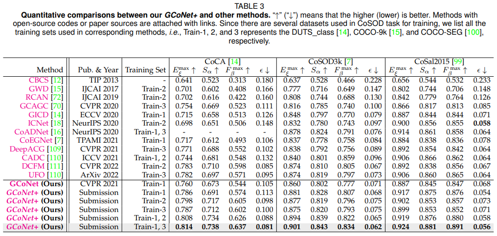
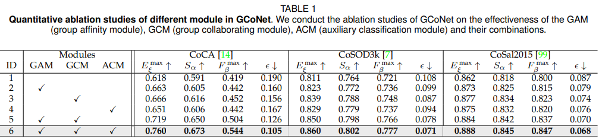
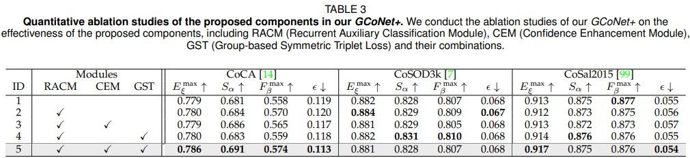
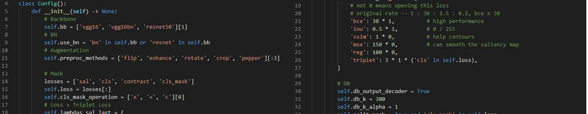
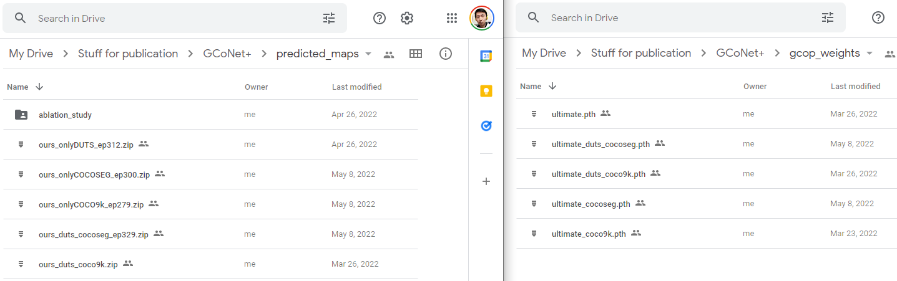

# GCoNet+
This repo is the official implementation of "GCoNet+: A Stronger Group Collaborative Co-Salient Object Detector".

## Abstract

In this paper, we present a novel end-to-end group collaborative learning network, termed GCoNet+, which can effectively and efficiently (250 fps) identify co-salient objects in natural scenes. The proposed GCoNet+ achieves the new state-of-the-art performance for co-salient object detection (CoSOD) through mining consensus representations based on the following two essential criteria: 1) intra-group compactness to better formulate the consistency among co-salient objects by capturing their inherent shared attributes using our novel group affinity module (GAM); 2) inter-group separability to effectively suppress the influence of noisy objects on the output by introducing our new group collaborating module (GCM) conditioning on the inconsistent consensus. To further improve the accuracy, we design a series of simple yet effective components as follows: i) a recurrent auxiliary classification module (RACM) promoting the model learning at the semantic level; ii) a confidence enhancement module (CEM) helping the model to improve the quality of the final predictions; and iii) a group-based symmetric triplet (GST) loss guiding the model to learn more discriminative features. Extensive experiments on three challenging benchmarks, i.e., CoCA, CoSOD3k, and CoSal2015, demonstrate that our GCoNet+ outperforms the existing 12 cutting-edge models. Code has been released at https://github.com/ZhengPeng7/GCoNet_plus.

## Framework Overview

> The figure of network architecture is drawn by [Inkscape (0.92.5)](https://inkscape.org/release/inkscape-0.92.5/) as a .svg file. You can download and modify it if you find it useful.


## Result

+ Comparison with the previous state-of-the-art methods with different training sets:



+ Ablation study:






## Usage

1. **Environment**

    ```
    GPU: V100 x 1
    Install Python 3.7, PyTorch 1.8.2
    pip install requirements.txt

2. **Datasets preparation**

    Download all the single train/test datasets from my [google-drive](https://drive.google.com/drive/folders/1jRJKv56QSa3gOp4w_64tVmzNMT_te-Kv?usp=sharing), or directly download the `datasets.zip` in the folder for all the data you need as following structure shows (COCO-SEG is too big, so you can download it separately). The file directory structure on my machine is as follows:

    ```
    +-- datasets
    |	+-- sod
    |   	+-- images
    |   		+-- DUTS_class
    |   		+-- COCO-9k
    |   		...
    |   		+-- CoSal2015
    |   	+-- gts
    |   		+-- DUTS_class
    |   		+-- COCO-9k
    |   		...
    |   		+-- CoSal2015
    |	...
    ...
    +-- codes
    |	+-- sod
    |   	+-- GCoNet_plus
    |   	...
    |	...
    ...
    ```

3. **Update the paths**

    Replace all `/root/datasets/sod/GCoNet_plus` and `/root/codes/sod/GCoNet_plus` in this project to  `/YOUR_PATH/datasets/sod/GCoNet_plus` and `/YOUR_PATH/codes/sod/GCoNet_plus`, respectively.

4. **Training + Test + Evaluate + Select the Best**

    `./gco.sh`

    If you can apply more GPUs on DGX cluster, you can `./sub_by_id.sh` to submit multiple times for more stable results.

    If you have the OOM problem, plz decrease `batch_size` in `config.py`.

5. **Adapt the settings of modules in config.py**

    You can change the weights of losses, try various *backbones* or use different *data augmentation* strategy. There is also some modules coded but not used in this work, like *adversarial training*, the *refiner* in [BASNet](https://openaccess.thecvf.com/content_CVPR_2019/papers/Qin_BASNet_Boundary-Aware_Salient_Object_Detection_CVPR_2019_paper.pdf), weighted *multiple output and supervision* used in [GCoNet](https://openaccess.thecvf.com/content/CVPR2021/papers/Fan_Group_Collaborative_Learning_for_Co-Salient_Object_Detection_CVPR_2021_paper.pdf) and [GICD](https://www.ecva.net/papers/eccv_2020/papers_ECCV/papers/123570443.pdf), etc.

    

## Download

​	Find **well trained models** + **predicted saliency maps** and all other stuff on my [google-drive folder for this work](https://drive.google.com/drive/folders/1SIr_wKT3MkZLtZ0jacOOZ_Y5xnl9-OPw?usp=sharing):



## Acknowledgement

We appreciate the codebases of [GICD](https://github.com/zzhanghub/gicd), [GCoNet](https://github.com/fanq15/GCoNet). Thanks for the CoSOD evaluation toolbox provided in [eval-co-sod](https://github.com/zzhanghub/eval-co-sod).

## Contact

Any question, discussion or even complaint, feel free to leave issues here or send me e-mails (zhengpeng0108@gmail.com).

