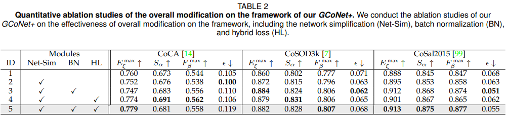

# GCoNet+
This repo is the official implementation of "GCoNet+: Group Collaborative Learning for Co-Salient Object Detection".

## Abstract

Abstract—In this paper, we present a novel end-to-end Group Collaborative Learning Network, termed GCoNet+, which can efficiently
(250 fps) identify co-salient objects in natural scenes. GCoNet+ is based on group collaborative learning that simultaneously mines
consensus representations. We achieve the new state-of-the-art performance by introducing two essential criteria: 1) intra-group
compactness to better formulate the consistency among co-salient objects by capturing their inherent shared attributes using our
novel group affinity module (GAM); 2) inter-group separability to effectively suppress the influence of noisy objects on the output by
introducing our new group collaborating module (GCM) conditioning the inconsistent consensus. To further improve the accuracy, we
design a series of simple components as follows: i) a recurrent auxiliary classification module (RACM) promotes model learning at
semantic-level; ii) a confidence enhancement module (CEM) helps model improvement on the quality of the final predictions; and iii) a
group-based symmetric triplet (GST) loss guides model learn more discriminative features. Extensive experiments on three challenging
benchmarks, i.e., CoCA, CoSOD3k, and CoSal2015, demonstrate that our GCoNet+ outperforms existing 11 cutting-edge models. Code
has been released at [https://github.com/ZhengPeng7/GCoNet_plus](https://github.com/ZhengPeng7/GCoNet_plus).

## Framework Overview


## Result

+ Comparison with the previous state-of-the-art methods:


+ Ablation study:





## Usage

1. **Environment**

```
GPU: V100 x 1
Install Python 3.7, PyTorch 1.8.2
pip install requirements.txt
```

2. **Datasets preparation**

    Download all the single train/test datasets from my [google-drive](https://drive.google.com/drive/folders/1jRJKv56QSa3gOp4w_64tVmzNMT_te-Kv?usp=sharing), or directly download the `datasets.zip` in the folder for all the data you need as following structure:

    ```
    +-- datasets
    |   +-- images
    |   	+-- DUTS_class
    |   	+-- COCO-9k
    |   	...
    |   	+-- CoSal2015
    |   +-- gts
    |   	+-- DUTS_class
    |   	+-- COCO-9k
    |   	...
    |   	+-- CoSal2015
    ```

3. **Training + Test + Evaluate + Select the Best**

    `./gco.sh`

    If you can apply more GPUs on DGX cluster, you can `./sub_by_id.sh` to submit multiple times for more stable results.

    If you have the OOM problem, plz decrease `batch_size` in `config.py`.

4. **Adapt the settings of modules in config.py**

    You can change the weights of losses, try various backbones or use different data augmentation strategy. There is also some modules coded but not used in this work, like adversarial training, refiner, weighted multiple output and supervision, etc.

    

## Download

​	Find **well trained models** + **predicted saliency maps** and all other stuff on my [google-drive folder for this work](https://drive.google.com/drive/folders/1SIr_wKT3MkZLtZ0jacOOZ_Y5xnl9-OPw?usp=sharing).

## Acknowledgement

We appreciate the codebase of [GICD](https://github.com/zzhanghub/gicd), [GCoNet](https://github.com/fanq15/GCoNet).

## Contact

Any question, discussion or even complaint, feel free to leave issues here or send me e-mails (zhengpeng0108@gmail.com).

